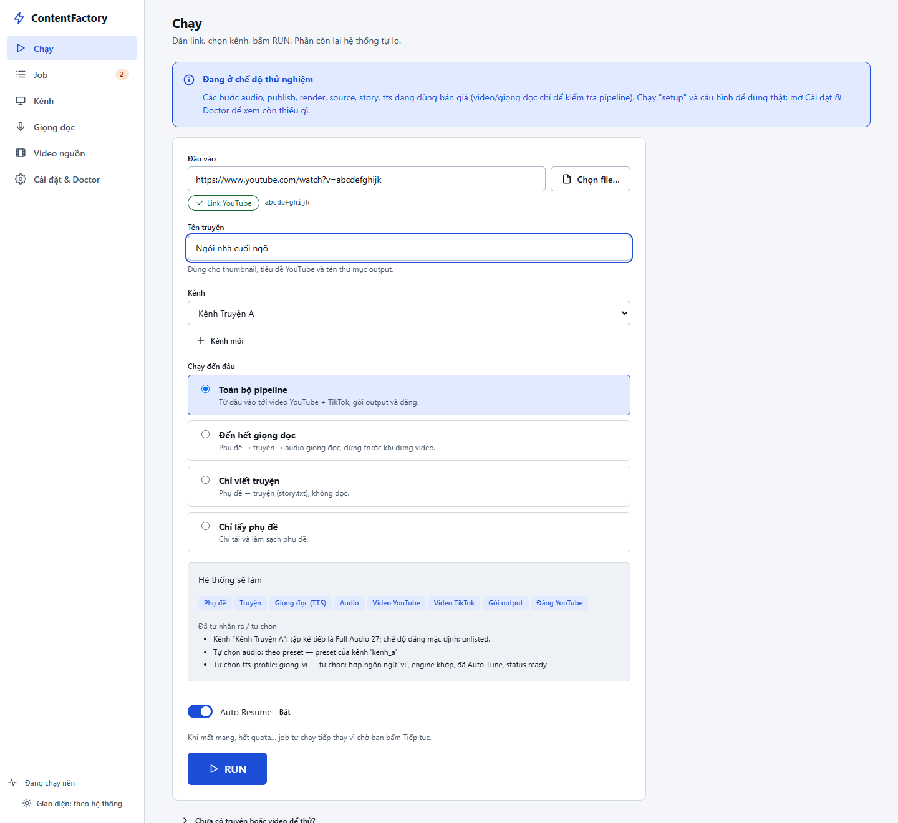
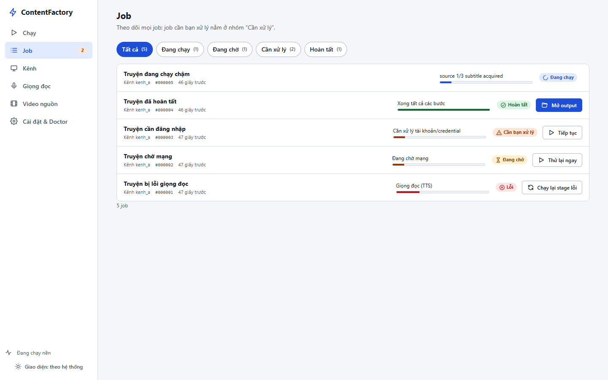
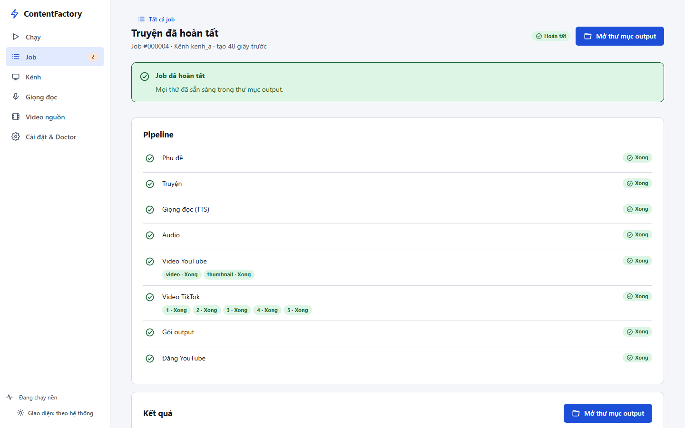
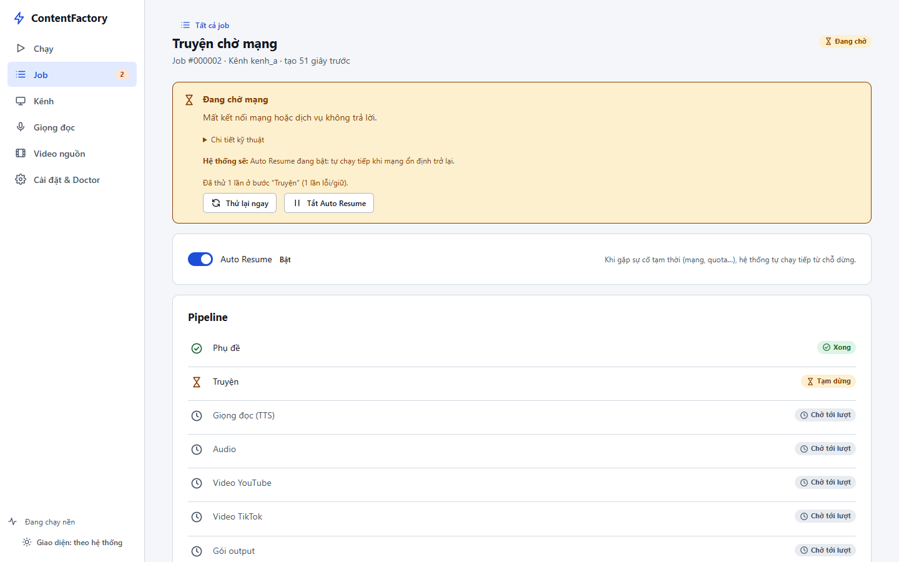
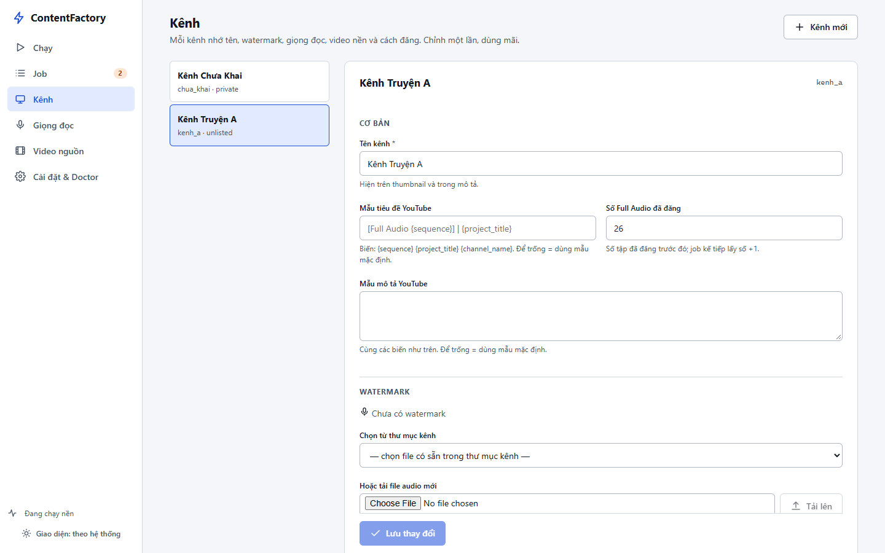
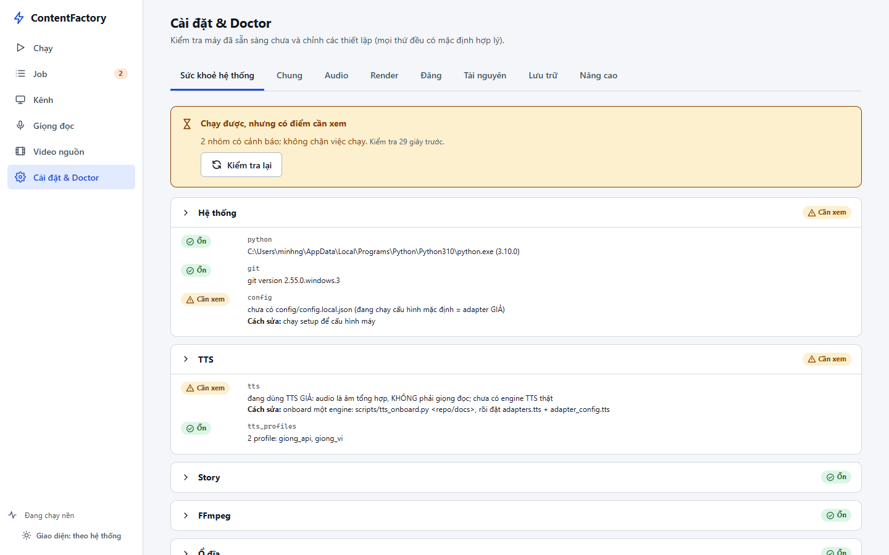
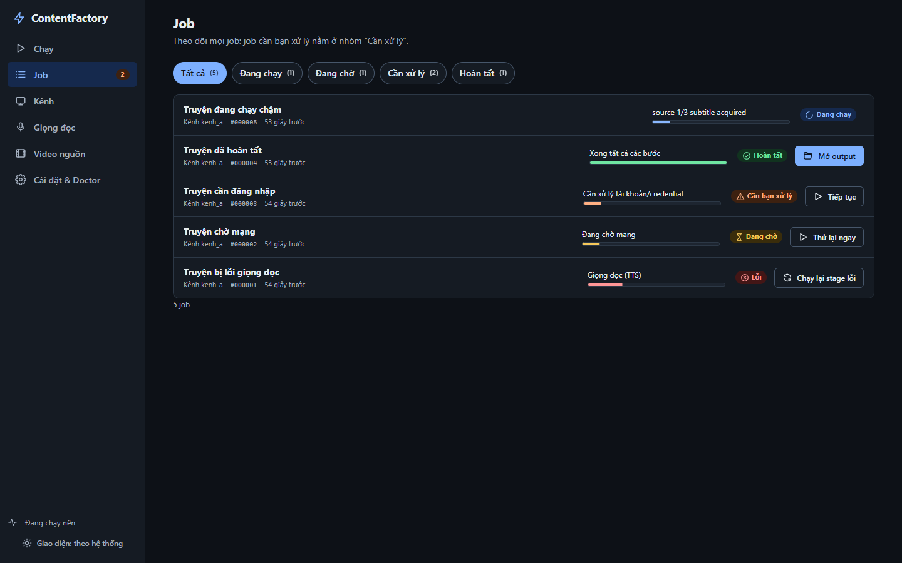
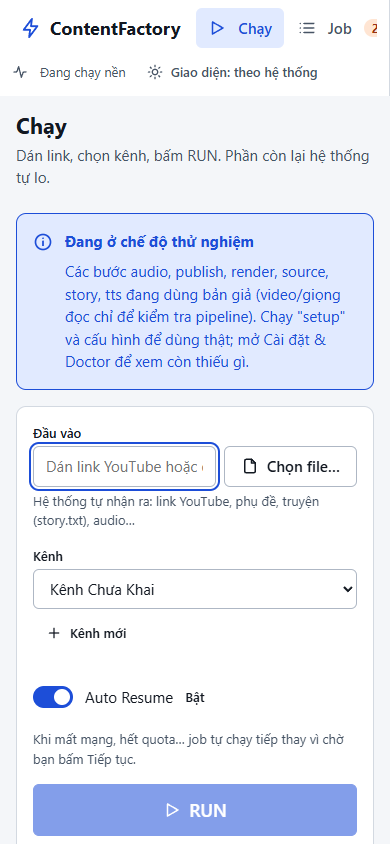
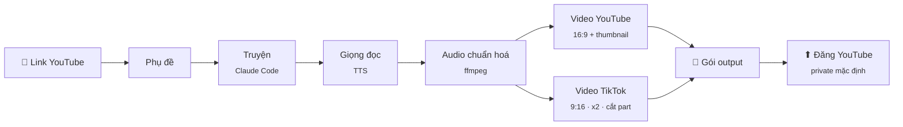

<div align="center">

# ⚡ ContentFactory

**Từ một link YouTube → 1 video YouTube hoàn chỉnh + N video TikTok + một thư mục sẵn sàng đăng.**

Dán link · chọn kênh · bấm **RUN**. Phần còn lại hệ thống tự lo — và luôn cho bạn biết nó đã chọn gì, vì sao.

<p>
  
  
  
  
  
  
</p>



[Bắt đầu nhanh](#-bắt-đầu-nhanh) · [Giao diện](#️-giao-diện) · [Cách hoạt động](#️-cách-hoạt-động) · [Dòng lệnh](#️-dòng-lệnh) · [Kênh](#-kênh-channel-preset) · [Độ tin cậy](#-độ-tin-cậy) · [Tài liệu](#-tài-liệu)

</div>

---

## ✨ Điểm nổi bật

<table>
<tr>
<td width="33%" valign="top">

### 🎯 Một thao tác
Dán link → RUN → **Mở thư mục output**. Không hỏi giữa chừng. Giọng đọc, video nền, tên, số tập đều được suy ra từ **kênh** và hiển thị rõ lý do.

</td>
<td width="33%" valign="top">

### 🔁 Không làm lại thừa
Mỗi bước có checkpoint. Mất mạng, hết quota, tắt máy giữa chừng? Job **tự chạy tiếp từ chỗ dừng**; lỗi một part TikTok chỉ dựng lại đúng part đó.

</td>
<td width="33%" valign="top">

### 🧭 Luôn biết chuyện gì đang xảy ra
Mỗi job nói rõ: đang ở bước nào, vì sao dừng, hệ thống sẽ làm gì tiếp, bạn cần bấm gì. Không cần đọc log hay stack trace.

</td>
</tr>
<tr>
<td valign="top">

### 🧩 Chạy một phần tuỳ ý
Đã có **phụ đề, truyện hay audio**? Đưa vào là hệ thống tự nhận ra và chỉ đề xuất các chế độ hợp lệ — không bắt bạn hiểu "stage".

</td>
<td valign="top">

### 🛡️ An toàn mặc định
Video đăng ở **private**; khai báo "dành cho trẻ em" không bao giờ bị đoán; thư mục output là **của bạn** — hệ thống không sửa, không xoá; bí mật không lọt vào log hay output.

</td>
<td valign="top">

### 🛠️ Máy mới trong vài phút
`setup.ps1` tự cài môi trường Python, ffmpeg, module, build uploader và chạy **Doctor** — còn thiếu gì thì nói đúng việc cần làm.

</td>
</tr>
</table>

---

## 🚀 Bắt đầu nhanh

```powershell
git clone <repo> ContentFactory
cd ContentFactory
.\setup.ps1                 # cài mọi thứ cần thiết; chạy lại bao nhiêu lần cũng được
```

Sau đó **bấm đúp `ContentFactory.cmd`** (hoặc `.\cf.cmd ui`) — trình duyệt mở giao diện, ứng dụng xử lý job ngay trong nền.

> [!TIP]
> **Chưa có truyện hay video để thử?** Màn hình **Chạy → "Chưa có truyện hoặc video để thử?" → Tạo dữ liệu mẫu**.
> Hệ thống tạo sẵn truyện, phụ đề, audio, video nền ngang/dọc và template thumbnail, rồi cấu hình giúp bạn. Bấm **"Dùng truyện mẫu"** → **RUN** là thấy toàn bộ pipeline chạy. (Dòng lệnh: `.\cf.cmd samples`.)

Không muốn mở giao diện? Một lệnh là đủ:

```powershell
.\cf.cmd go "https://www.youtube.com/watch?v=..." --channel kenh_a --open
```

### Kết quả

```text
output\20261005_ngoi-nha-cuoi-ngo\
├── README.txt          ← giải thích thư mục, danh sách part, cảnh báo (nếu có)
├── project.json        ← bản kê máy đọc được (đường dẫn, sha256, nguồn)
├── story.txt           ← truyện đầy đủ, không đánh số chương
├── youtube\
│   ├── video.mp4       ← 16:9, audio đã chuẩn hoá + watermark của kênh
│   ├── thumbnail.jpg   ← tên kênh + tên truyện
│   ├── title.txt       ← [Full Audio 27] | Ngôi nhà cuối ngõ
│   └── description.txt
└── tiktok\
    ├── part_01.mp4     ← 9:16, giọng x2 giữ nguyên cao độ,
    ├── part_02.mp4        cắt ở ranh giới câu/đoạn
    └── …
```

Thư mục này thuộc về bạn: chép, di chuyển, xoá tuỳ ý. Dựng lại sẽ tạo phiên bản mới bên cạnh (`…-v2`), không ghi đè.

---

## 🖥️ Giao diện

<table>
<tr>
<td width="50%"><br><sub><b>Job</b> — lọc Đang chạy / Đang chờ / Cần xử lý / Hoàn tất; mỗi dòng có đúng một nút cần bấm.</sub></td>
<td width="50%"><br><sub><b>Chi tiết job</b> — pipeline 8 bước, từng part TikTok, nút <b>Mở thư mục output</b>.</sub></td>
</tr>
<tr>
<td><br><sub><b>Khi bị gián đoạn</b> — vì sao dừng, hệ thống sẽ làm gì, bật/tắt Auto Resume, Thử lại ngay.</sub></td>
<td><br><sub><b>Kênh</b> — form rõ ràng thay cho JSON: giọng đọc, video nền, render, đăng, xem trước tiêu đề.</sub></td>
</tr>
<tr>
<td><br><sub><b>Doctor</b> — 12 hạng mục: Ổn / Cần xem / Cần xử lý, kèm cách sửa.</sub></td>
<td><br><sub><b>Giao diện tối</b> — theo hệ thống hoặc chọn tay; tương phản ≥ 4.5:1.</sub></td>
</tr>
</table>

<details>
<summary><b>Thiết kế cho người dùng thật</b></summary>

<br>

- **Tiết lộ dần:** màn hình chính chỉ hỏi những gì không suy ra được; mọi tuỳ chọn nâng cao nằm trong vùng thu gọn, tab hoặc trang riêng.
- **Trạng thái không chỉ bằng màu:** mỗi trạng thái có chữ + biểu tượng; "đang chờ mạng" (vàng) khác "cần bạn xử lý" (cam) khác "lỗi" (đỏ).
- **Không bấm trùng:** bấm đúp RUN vẫn chỉ tạo một job (khoá ở giao diện + chống trùng ở backend).
- **Truy cập:** điều hướng bằng bàn phím, focus rõ ràng, tôn trọng *giảm chuyển động*; axe-core: 0 vi phạm nghiêm trọng.
- **Nhẹ:** ~160 KB tài nguyên, không CDN, chạy offline — số đo ở [`docs/PERFORMANCE.md`](docs/PERFORMANCE.md).



</details>

---

## ⚙️ Cách hoạt động



| Bước | Làm gì | Thành phần |
|---|---|---|
| **Phụ đề** | Lấy phụ đề, dựng lại thành transcript có cấu trúc | Subtitle_supperVip → yt-dlp |
| **Truyện** | Viết lại thành `story.txt` liền mạch, không đánh số chương | Claude Code CLI + oh-story |
| **Giọng đọc** | Chia đoạn theo luật của engine, đọc, ghép thành Master audio | TTS adapter (onboard từ repo/docs) |
| **Audio** | Chuẩn hoá loudness, chống click/clipping, watermark YouTube, tăng tốc x2 giữ cao độ, cắt part TikTok | ffmpeg |
| **Video** | Thumbnail + video YouTube 16:9, từng part TikTok 9:16, video nền đồng bộ dùng chung | ContentFlow |
| **Output → Đăng** | Đóng gói có kiểm sha256, upload idempotent | builtin · yt-uploader |

Mỗi bước có bản **giả** để thử miễn phí trong vài giây: `.\cf.cmd demo`.

---

## ⌨️ Dòng lệnh

`cf` = `.\cf.cmd` (cmd) hoặc `.\cf.ps1` (PowerShell).

| Lệnh | Việc |
|---|---|
| `cf ui` | Mở giao diện **và** chạy xử lý nền |
| `cf go "<url>" --channel K [--title "…"] [--open]` | Chạy hết pipeline cho một link, ra gói output |
| `cf inspect <link>` · `cf batch create "<kênh/playlist>" --channel K [--newest 10]` | Nhận dạng link; tạo Channel Run (mỗi video một job con độc lập; `cf batch discover/status/pause/resume/retry-failed/…`) |
| `cf samples` | Tạo dữ liệu mẫu (truyện, phụ đề, audio, video nền) để thử |
| `cf status` · `cf open [job]` | Xem các job · mở thư mục output gần nhất |
| `cf resume <job>` · `cf retry <job>` | Tiếp tục job đang bị giữ · chạy lại đúng bước lỗi |
| `cf doctor [--json]` | Kiểm tra máy đã sẵn sàng chưa; thiếu gì thì nói cách sửa |
| `cf channels` · `cf channel-init <id>` | Danh sách kênh · tạo kênh mới |
| `cf start` | Dịch vụ nền không giao diện (uploader, video nền, auto resume, dọn dẹp) |
| `cf setup` · `cf update` | Cài máy mới · cập nhật code/module/thư viện (= `setup.ps1` / `update.ps1`) |
| `cf demo` | Chạy thử toàn pipeline bằng adapter giả |

Lệnh nâng cao (`submit`, `plan`, `pools`, `retry-part`, `cleanup`, `sequences`…): `cf --advanced -h`.

---

## 📺 Kênh (Channel preset)

Mỗi kênh nhớ cấu hình của chính nó — chỉnh **một lần** ở trang **Kênh** (hoặc `channels\<id>\channel.json`), dùng mãi:

```jsonc
{
  "name": "Kênh Truyện A",
  "title_template": "[Full Audio {sequence}] | {project_title}",
  "sequence": { "last_used": 26 },                  // tập kế tiếp: 27
  "watermark": "watermark.wav",
  "publishing": { "privacy": "private", "made_for_kids": false, "tags": ["truyen"] },
  "templates": {                                     // chọn TÊN template — không có toạ độ, kích thước, font…
    "thumbnail":     { "id": "thumb_gold",     "version_policy": "latest_published" },
    "youtube_video": { "id": "youtube_framed", "version_policy": "latest_published" },
    "tiktok_video":  { "id": "tiktok_default" }
  },
  "preset": {
    "tts_profile": null,                             // null = tự chọn theo ngôn ngữ/engine
    "pools": { "youtube": "gameplay", "tiktok": "gameplay_vertical" },
    "tiktok": { "speed": 2.0, "target_part_sec": 600 }
  }
}
```

Thứ tự ưu tiên: **bạn nhập > preset kênh > mặc định**. Mọi lựa chọn tự động đều được ghi lại và hiển thị.

### 🖼️ Template (khung hình & thumbnail)

Bố cục thumbnail, video YouTube và video TikTok là **template có phiên bản** (do ContentFlow quản lý): khung, vùng video, vị trí chữ. Kênh chỉ chọn tên (`cf templates list`; `cf templates use <kênh> youtube_video youtube_framed`). Tạo/sửa bằng trang **Template** (Template Studio: kéo thả, xem trước, render thử, publish). Job chốt đúng version lúc tạo — sửa template sau đó **không** làm đổi job đang có. Xem [Template](docs/TEMPLATE_SYSTEM.md).

---

## 🤖 Tự động hoá

| | |
|---|---|
| **Auto Resume** | Mất mạng, hết quota, hết hạn mức AI, thiếu chỗ đĩa → job được *giữ* rồi tự chạy tiếp khi hết nguyên nhân. Việc cần người (đăng nhập, thiếu file) thì dừng ngay và nói rõ. |
| **Auto Retry** | Lỗi tạm thời được thử lại có giãn cách; chỉ chạy lại **đúng phần lỗi** (một part, một lần upload). |
| **Auto Cleanup** | Dọn file trung gian sau khi đăng, job cũ, cache quá cỡ — **không bao giờ đụng `output\`**. |
| **Auto Naming** | Tiêu đề nguồn được làm sạch (bỏ emoji, hashtag, link), nhưng vẫn **cảnh báo** để bạn đặt tên riêng trước khi đăng. |
| **Tự chọn** | Giọng đọc theo ngôn ngữ, engine, độ tin cậy; video nền theo hướng khung hình. Mơ hồ thì **không đoán**. |

---

## ✅ Độ tin cậy

Kiểm chứng **thật** trên máy phát triển (chi tiết: [`docs/PRODUCTION_CHECKLIST.md`](docs/PRODUCTION_CHECKLIST.md)):

| Đã kiểm chứng | |
|---|:---:|
| Phụ đề thật từ link YouTube thật → audio ffmpeg thật → render ContentFlow thật → gói output | ✅ |
| Video YouTube 1920×1080 · TikTok 1080×1920 · tổng các part ×2 khớp audio YouTube | ✅ |
| Kill tiến trình giữa lúc render thật → khởi động lại → chạy tiếp, không làm lại audio | ✅ |
| Mất mạng / quota / token / ổ đĩa / part lỗi / upload lỗi — Auto Resume bật & tắt | ✅ |
| Bí mật không xuất hiện trong output, log, DB, workspace, `status`, `doctor --json` | ✅ |
| Giao diện: 158 kiểm tra trên Chrome thật (luồng chính, bàn phím, a11y, 4 cỡ cửa sổ × sáng/tối, rò rỉ) | ✅ |
| 491 test tự động (Python + Node) | ✅ |

> [!IMPORTANT]
> **Chưa sẵn sàng production đầy đủ** — những phần dưới đây cần điều kiện bên ngoài mới kiểm chứng được:
> - **TTS thật:** chưa onboard engine nào; mặc định là giọng giả (âm tổng hợp). Doctor luôn cảnh báo.
> - **Upload YouTube thật:** chưa chạy (cần OAuth client Google + `yt-uploader login`).
> - **Story thật bằng Claude:** chưa kiểm chứng đủ với tiếng Việt và truyện dài; chi phí token chưa đo.
> - NVENC, video 10–60 phút, Linux/macOS, trình duyệt ngoài Chrome: chưa thử.

---

## 🧰 Yêu cầu & cấu hình

- **Windows 10/11**, Python **≥ 3.10** (setup tự cài qua winget nếu thiếu), ffmpeg bản *full* (setup tự cài).
- Tuỳ theo tính năng: Claude Code CLI (viết truyện), Go (build uploader), một engine TTS, OAuth client Google (đăng YouTube), GPU NVIDIA (render nhanh hơn).

| File | Vai trò | Commit? |
|---|---|:---:|
| `config\config.json` | Mặc định an toàn (adapter giả) | ✅ |
| `config\config.local.json` | Cấu hình của máy này (do `setup` sinh; trang Cài đặt ghi vào) | ❌ |
| `config\secrets.local.env` | `KEY=VALUE` cho bí mật | ❌ |
| `channels\`, `tts_profiles\`, `samples\` | Dữ liệu của bạn | ❌ |

---

## 📚 Tài liệu

| Dành cho | Tài liệu |
|---|---|
| **Người dùng** | [Hướng dẫn sử dụng](docs/USER_GUIDE.md) · [Giao diện](docs/UI_GUIDE.md) · [Xử lý sự cố](docs/TROUBLESHOOTING.md) |
| **Vận hành** | [Production checklist](docs/PRODUCTION_CHECKLIST.md) · [Hiệu năng](docs/PERFORMANCE.md) |
| **Phát triển** | [Kiến trúc](docs/ARCHITECTURE.md) · [Thiết kế đầy đủ](HANDOFF.md) · [Quyết định D-01…](docs/DECISIONS.md) · [Hợp đồng module](docs/MODULE_CONTRACTS.md) · [Template](docs/TEMPLATE_SYSTEM.md) · [Schema template](docs/TEMPLATE_SCHEMA.md) · [Asset](docs/ASSET_MANAGEMENT.md) · [Design system](docs/DESIGN_SYSTEM.md) · [Audit UI/UX](docs/UI_UX_AUDIT.md) · [Lệnh nâng cao](docs/DEVELOPER.md) |

---

## 👩‍💻 Phát triển

```powershell
python -m unittest discover -s tests -t .                 # toàn bộ test (lõi chỉ cần stdlib)

# test với công cụ thật (sau khi đã chạy setup)
$env:CF_TEST_CONTENTFLOW_PYTHON = ".venv\Scripts\python.exe"
$env:CF_TEST_YT_UPLOADER_EXE    = "tools\yt-uploader.exe"

python scripts\validate_real.py "<URL YouTube>"            # kiểm chứng pipeline thật, đo thời gian từng bước

cd scripts\ui_qa ; npm install ; cd ..\..                  # QA giao diện bằng Chrome + axe-core (một lần)
python scripts\ui_qa\fixture_server.py --port 8799         # giao diện với dữ liệu mẫu
node scripts\ui_qa\qa.mjs http://127.0.0.1:8799 <root>\fixture.json
```

**Nguyên tắc kiến trúc:** các module (`source`, `story`, `tts`, `audio`, `render`, `publish`, `output`) độc lập, chỉ giao tiếp qua artifact + contract — có test AST chặn import chéo; chỉ `orchestrator` nối chúng. Frontend không chứa logic nghiệp vụ; mọi thứ đi qua facade `service.py`.

<div align="center">
<br>
<sub>Lõi Python chỉ dùng thư viện chuẩn · giao diện ES modules không bước build · GSAP đóng gói cục bộ</sub>
</div>
